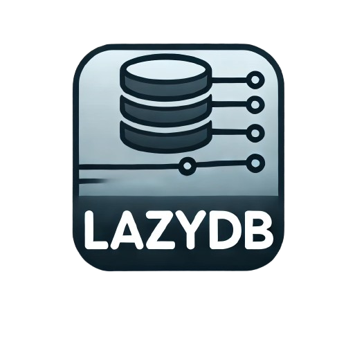

<p align="center">
  
</p>

# LazyDB

LazyDB is a high-performance, type-safe document database built on top of LMDB (Lightning Memory-Mapped Database). It provides an intuitive, functional API with strong TypeScript support, ACID-compliant transactions, and robust error handling.

[](https://www.npmjs.com/package/@takinprofit/lazydb)
[](https://opensource.org/licenses/MIT)

## Features

- **Type-Safe Collections**: Full TypeScript support with type inference for documents and queries
- **ACID Transactions**: Guaranteed data consistency with atomic operations
- **High Performance**: Built on LMDB for lightning-fast read and write operations
- **Event-Driven Architecture**: React to database operations with typed event emitters
- **Flexible Querying**: Rich query API with support for filtering, mapping, and pagination
- **Robust Error Handling**: Comprehensive error types for precise error management
- **Advanced Features**: Document versioning, backup/restore, and compression support
- **Memory Efficient**: Uses memory-mapped files for optimal memory usage
- **Multi-Process Safe**: Safe for use across multiple Node.js processes

## Table of Contents

- [LazyDB](#lazydb)
  - [Features](#features)
  - [Table of Contents](#table-of-contents)
  - [Installation](#installation)
  - [Quick Start](#quick-start)
  - [Database Operations](#database-operations)
    - [Initialization](#initialization)
    - [Collection Management](#collection-management)
      - [Collection Options](#collection-options)
  - [Collections](#collections)
    - [Basic Operations](#basic-operations)
    - [Upsert Operations](#upsert-operations)
    - [RangeIterable Operations](#rangeiterable-operations)
      - [Available Options and Types](#available-options-and-types)
      - [Basic Query Patterns](#basic-query-patterns)
      - [Asynchronous Operations and Error Handling](#asynchronous-operations-and-error-handling)
      - [Advanced Query Patterns](#advanced-query-patterns)
  - [Transactions](#transactions)
  - [Events](#events)
    - [Database Events](#database-events)
    - [Collection Events](#collection-events)
  - [Error Handling](#error-handling)
  - [Advanced Features](#advanced-features)
    - [Custom ID Generation](#custom-id-generation)
    - [Compression Settings](#compression-settings)
    - [Database Options](#database-options)
  - [Testing](#testing)
  - [Contributing](#contributing)
    - [Development Setup](#development-setup)
    - [Project Structure](#project-structure)
    - [Available Scripts](#available-scripts)
    - [Code Quality](#code-quality)
    - [Submitting Changes](#submitting-changes)
    - [Package Distribution](#package-distribution)
    - [Issues and Bugs](#issues-and-bugs)
  - [API Reference](#api-reference)
  - [License](#license)
  - [Acknowledgments](#acknowledgments)

## Installation

```bash
npm install @takinprofit/lazydb

# or with yarn
yarn add @takinprofit/lazydb

# or with pnpm
pnpm add @takinprofit/lazydb
```

## Quick Start

```typescript
import { Database, Document } from '@takinprofit/lazydb'

// Define your document type
type User = Document<{
  name: string
  email: string
  age: number
  active: boolean
}>

// Initialize the database
const db = new Database('./my-database', {
  compression: true,
  maxCollections: 10
})

// Create a collection
const users = db.collection<User>('users')

// Insert a document
const user = await users.insert({
  name: 'John Doe',
  email: 'john@example.com',
  age: 30,
  active: true
})

// Find documents
const activeUsers = users.find({
  where: user => user.active && user.age >= 18
})

// Use the results
for (const user of activeUsers) {
  console.log(user.name)
}

// Clean up specific collection
await users.close() // Close single collection
// or
await db.closeCollection('users') // Close collection from database instance

// Clean up entire database
await db.close()
```

## Database Operations

### Initialization

LazyDB supports all LMDB options except `dupSort` and `maxDbs` (which is replaced with `maxCollections`). The configuration interface extends LMDB's options with additional LazyDB-specific features.

```typescript
import { Database } from '@takinprofit/lazydb'

const db = new Database('./db-path', {
  // LazyDB-specific options
  maxCollections: 10,        // Maximum number of collections (replaces LMDB's maxDbs)
  idGenerator: () => uuid(), // Custom ID generation function
  logger: console.log,       // Optional logging function

  // LMDB options (inherited from lmdb-js)
  compression: true,         // Enable LZ4 compression
  pageSize: 8192,           // Database page size
  overlappingSync: true,     // Enable overlapping sync for better performance
  encoding: 'msgpack',       // Value encoding format
  cache: true,              // Enable caching
  useVersions: false,       // Enable document versioning

  // Additional LMDB options
  mapSize: 2 * 1024 * 1024 * 1024,  // 2GB initial map size
  maxReaders: 126,                   // Maximum concurrent readers
  noMemInit: true,                   // Performance optimization for writes
  eventTurnBatching: true,          // Batch writes in same event turn
  commitDelay: 0,                    // Delay before committing writes
  encryptionKey: 'your-32-byte-key', // Enable encryption
  // ... and many more LMDB options
})
```

For a complete list of supported options, refer to the [LMDB.js documentation](https://github.com/kriszyp/lmdb-js?tab=readme-ov-file#db-options). LazyDB supports all LMDB options except:

- `dupSort` (not supported)
- `maxDbs` (use `maxCollections` instead)

LazyDB adds the following options:

- `maxCollections`: Maximum number of collections (replaces LMDB's `maxDbs`)
- `idGenerator`: Custom function for generating document IDs
- `logger`: Optional logging function for database operations

The configuration interface extends LMDB's options while providing type safety:

```typescript
export interface DatabaseConfig extends Partial<SafeRootDatabaseOptionsWithPath> {
  logger?: DatabaseLogger
}

// Removes unsupported LMDB options and adds LazyDB-specific ones
export type SafeRootDatabaseOptionsWithPath = Omit<
  RootDatabaseOptionsWithPath,
  "dupSort" | "maxDbs"
> & {
  maxCollections?: number
  idGenerator?: IdGenerator
}
```

### Collection Management

Collections in LazyDB can be managed through several methods, and each collection can be configured with its own options.

```typescript
// Create/get a collection with options
const users = db.collection<User>('users', {
  // Collection-specific options (inherited from LMDB)
  encoding: 'msgpack',           // Value encoding format
  compression: true,             // Enable LZ4 compression
  cache: true,                   // Enable caching
  useVersions: false,           // Enable document versioning
  keyEncoding: 'ordered-binary', // Key encoding format
  strictAsyncOrder: false,      // Async operation ordering
  sharedStructuresKey: Symbol.for('structures'), // For msgpack/cbor encoding

  // LazyDB-specific options
  idGenerator: () => uuid(),    // Override default ID generator
})

// Collection operations
await db.clearCollection('users')              // Clear all documents
await db.dropCollection('users')               // Remove the collection
await users.close()                            // Close collection instance
// or
await db.closeCollection('users')              // Close collection from database

// Database-wide operations
await db.clearAll()                            // Clear all collections
await db.backup('./backup-path', true)         // Create backup (with compaction)
await db.close()                               // Close the database
```

#### Collection Options

When creating a collection with `db.collection<T>(name, options?)`, the following options are supported:

```typescript
interface DatabaseOptions {
  // Encoding options
  encoding?: 'msgpack' | 'json' | 'string' | 'binary' | 'ordered-binary'
  keyEncoding?: 'uint32' | 'binary' | 'ordered-binary'
  sharedStructuresKey?: Key              // For msgpack/cbor optimization

  // Performance options
  cache?: boolean | object               // Enable/configure caching
  compression?: boolean | CompressionOptions
  strictAsyncOrder?: boolean            // Order of async operations

  // Feature flags
  useVersions?: boolean                 // Enable document versioning
}

// LazyDB collection options exclude dupSort and add idGenerator
type SafeDatabaseOptions = Omit<DatabaseOptions, "dupSort"> & {
  idGenerator?: IdGenerator            // Custom ID generation
}
```

All LMDB database options are supported except `dupSort`. Each collection can override the database's default settings for:

- Document and key encoding
- Compression settings
- Caching behavior
- Version tracking
- ID generation
- Async operation ordering

For detailed information about these options, see the [LMDB.js documentation](https://github.com/kriszyp/lmdb-js?tab=readme-ov-file#db-options).

## Collections

Collections provide type-safe access to groups of related documents.

### Basic Operations

```typescript
// Insert a single document
const user = await users.insert({
  name: 'Jane Smith',
  email: 'jane@example.com',
  age: 25,
  active: true
})

// Insert multiple documents
const newUsers = await users.insertMany([
  { name: 'User 1', email: 'user1@example.com', age: 20, active: true },
  { name: 'User 2', email: 'user2@example.com', age: 30, active: false }
])

// Update a document
const updated = await users.updateOne(
  { where: user => user._id === 'some-id' },
  { age: 26, active: false }
)

// Update multiple documents
const updateCount = await users.updateMany(
  { where: user => user.age < 18 },
  { active: false }
)

// Remove a document
const removed = await users.removeOne({
  where: user => user.email === 'jane@example.com'
})

// Remove multiple documents
const removedCount = await users.removeMany({
  where: user => !user.active
})
```

### Upsert Operations

```typescript
// Upsert a single document
const upserted = await users.upsert(
  { where: user => user.email === 'john@example.com' },
  { name: 'John Doe', email: 'john@example.com', age: 30, active: true }
)

// Upsert multiple documents
const upsertedUsers = await users.upsertMany([
  {
    where: user => user.email === 'user1@example.com',
    doc: { name: 'User 1', email: 'user1@example.com', age: 25, active: true }
  },
  {
    where: user => user.email === 'user2@example.com',
    doc: { name: 'User 2', email: 'user2@example.com', age: 35, active: true }
  }
])

## Querying

LazyDB provides a powerful querying API through the `find()` method, which returns a `RangeIterable`. This allows for efficient, lazy evaluation of query results with support for synchronous and asynchronous transformations.

### Basic Queries

```typescript
// Find all active users
const activeUsers = users.find({
  where: user => user.active
})

// Find with multiple conditions
const qualifiedUsers = users.find({
  where: user => user.age >= 18 && user.active && user.email.includes('@example.com')
})

// Using snapshot option for long-running queries
const largeDataset = users.find({
  where: user => user.active,
  snapshot: false  // Allows LMDB to collect freed space during iteration
})
```

### RangeIterable Operations

The `RangeIterable` class combines LMDB's powerful range queries with a flexible method chaining API. All operations are lazy and only execute when consumed via a terminal operation (`forEach`, `asArray`, or iteration).

#### Available Options and Types

```typescript
// Main query options combining LMDB range options with where clause
interface FindOptions<T> extends RangeOptions {
  // Filter function for documents
  where?: (entry: T) => boolean

  // Inherited from LMDB RangeOptions
  start?: Key              // Starting key
  end?: Key               // Ending key
  reverse?: boolean       // Reverse traversal
  limit?: number         // Maximum entries to read
  offset?: number        // Number of entries to skip
  versions?: boolean     // Include version numbers
  snapshot?: boolean     // Use database snapshot (default: true)
}

// Available methods on RangeIterable
interface RangeIterable<T> {
  map<U>(callback: (entry: T) => U | Promise<U>): RangeIterable<U>
  flatMap<U>(callback: (entry: T) => U[] | Promise<U[]>): RangeIterable<U>
  filter(callback: (entry: T) => boolean | Promise<boolean>): RangeIterable<T>
  slice(start: number, end: number): RangeIterable<T>
  forEach(callback: (entry: T) => void): void  // Terminal operation
  mapError<U>(callback: (error: Error) => U): RangeIterable<U>
  asArray: T[]  // Terminal operation
}
```

#### Basic Query Patterns

```typescript
interface FindOptions<T> extends RangeOptions {
  where?: (entry: T) => boolean

  // From LMDB RangeOptions:
  start?: Key        // Starting key - any valid key type (primitive or array of primitives)
  end?: Key         // Ending key - any valid key type (primitive or array of primitives)
  reverse?: boolean // Reverse traversal through keys (false by default)
  limit?: number    // Maximum number of entries to read (no limit by default)
  offset?: number   // Number of entries to skip (starts at 0 by default)
  versions?: boolean // Include version numbers in returned entries (false by default)
  snapshot?: boolean // Use database snapshot for iteration (true by default)
}

// Example using range options
const userRange = users.find({
  start: 100,              // Start at key 100
  end: 200,               // End at key 200
  reverse: false,         // Normal order
  limit: 50,              // Read maximum 50 entries
  offset: 10,             // Skip first 10 entries
  where: user => user.active && user.age >= 21
})

// Example with primitive array keys
const complexRange = users.find({
  start: ['user', 1000],
  end: ['user', 2000],
  where: user => user.active
})

Keys can be any JS primitive (string, number, boolean, symbol), an array of primitives, or a Buffer. The ordering follows these rules (from LMDB.js documentation):

null                    // lowest possible value
Symbol.for('example')   // symbols
false
true
-10                     // negative numbers supported
-1.1                    // decimals supported
400
3E10
'Hello'
['Hello', 'World']
'World'
'hello'
['hello', 1, 'world']
['hello', 'world']
Buffer.from([255])      // buffers are used directly


// Chain operations after where clause
const processedUsers = users.find({
  where: user => user.status === 'active',
  limit: 1000
})
  .map(user => ({
    ...user,
    fullName: `${user.firstName} ${user.lastName}`,
    age: calculateAge(user.birthDate)
  }))
  .filter(user => user.age >= 18)
  .asArray

// Combining where clauses with flatMap
const userConnections = users.find({
  where: user => user.connectionCount > 0
})
  .flatMap(async user => {
    const connections = await fetchUserConnections(user._id)
    return connections.map(conn => ({
      userId: user._id,
      connectionId: conn.id,
      type: conn.type
    }))
  })

// Complex filtering with multiple conditions
const eligibleUsers = users.find({
  where: user => {
    const hasRequiredFields = user.email && user.phoneNumber
    const isVerified = user.emailVerified && user.phoneVerified
    const meetsAgeRequirement = user.age >= 21
    const hasActiveSubscription =
      user.subscription?.status === 'active' &&
      user.subscription?.expiryDate > new Date()

    return hasRequiredFields &&
           isVerified &&
           meetsAgeRequirement &&
           hasActiveSubscription
  }
})
```

#### Asynchronous Operations and Error Handling

```typescript
// Async mapping with error handling
const enrichedUsers = users.find({
  where: user => user.requiresEnrichment
})
  .map(async user => {
    try {
      const [profile, preferences, metrics] = await Promise.all([
        fetchUserProfile(user._id),
        fetchUserPreferences(user._id),
        calculateUserMetrics(user._id)
      ])

      return {
        ...user,
        profile,
        preferences,
        metrics
      }
    } catch (error) {
      throw new Error(`Enrichment failed for ${user._id}: ${error.message}`)
    }
  })
  .mapError(error => {
    logger.error('User enrichment failed:', error)
    return null
  })
  .filter(user => user !== null)

// Process async results with batching
const batchSize = 100
for await (const user of enrichedUsers) {
  await processBatch(user)
}

// Complex error handling with different strategies
const validatedUsers = users.find({
  where: user => user.status === 'pending_validation'
})
  .map(async user => {
    const validationResult = await validateUser(user)
    if (!validationResult.success) {
      throw new Error(`VALIDATION_${validationResult.code}`)
    }
    return {
      ...user,
      validatedAt: new Date(),
      validatedBy: 'system'
    }
  })
  .mapError(error => {
    if (error.message.startsWith('VALIDATION_')) {
      const code = error.message.split('_')[1]
      switch (code) {
        case 'INVALID_EMAIL':
          return { status: 'invalid_email', retryable: true }
        case 'BLOCKED':
          throw error // Terminate iteration
        default:
          return { status: 'unknown_error', retryable: false }
      }
    }
    return { status: 'system_error', retryable: true }
  })
```

#### Advanced Query Patterns

```typescript
// Composite queries with multiple async operations
const userAnalytics = users.find({
  where: user => user.analyticsEnabled,
  limit: 1000
})
  .map(async user => {
    // Parallel fetch of user data
    const [
      activityMetrics,
      engagementScore,
      riskAnalysis
    ] = await Promise.all([
      fetchActivityMetrics(user._id),
      calculateEngagementScore(user._id),
      performRiskAnalysis(user._id)
    ])

    return {
      userId: user._id,
      metrics: activityMetrics,
      engagement: engagementScore,
      risk: riskAnalysis
    }
  })
  .filter(async data => {
    const isHighValue = data.engagement.score > 75
    const isLowRisk = data.risk.level === 'low'
    const isActive = await checkUserActivity(data.userId)

    return isHighValue && isLowRisk && isActive
  })
  .mapError(error => {
    logger.error('Analytics processing failed:', error)
    return null
  })

// Pagination with complex sorting
function getUserPage(pageNumber: number, pageSize: number) {
  return users.find({
    where: user => user.active,
    reverse: true,  // Latest first
    offset: pageNumber * pageSize,
    limit: pageSize
  })
    .map(async user => {
      const lastActivity = await getLastActivity(user._id)
      return {
        ...user,
        lastActivity
      }
    })
    .filter(user => user.lastActivity > dayjs().subtract(30, 'days').toDate())
    .asArray
}

// Data transformation with validation
const userReports = users.find({
  where: user => user.reportingEnabled
})
  .flatMap(async user => {
    const reports = await fetchUserReports(user._id)
    return reports.map(report => ({
      userId: user._id,
      reportId: report.id,
      data: report.data,
      timestamp: report.createdAt
    }))
  })
  .map(async report => {
    const validated = await validateReport(report)
    if (!validated.success) {
      throw new Error(`INVALID_REPORT:${report.reportId}`)
    }
    return validated.data
  })
  .mapError(error => {
    if (error.message.startsWith('INVALID_REPORT:')) {
      const reportId = error.message.split(':')[1]
      logger.warn(`Skipping invalid report: ${reportId}`)
      return null
    }
    throw error // Rethrow unexpected errors
  })
  .filter(report => report !== null)
```

> **Important Notes:**
>
> - `forEach` and `asArray` are terminal operations that consume the iterator
> - Setting `snapshot: false` allows LMDB to collect freed space but may not provide a consistent view
> - Async operations in `map` and `filter` create async iterables
> - For large datasets, consider batching and pagination
> - `mapError` can be used for both error recovery and iteration termination

For more details about the underlying LMDB range operations, refer to the [LMDB.js documentation](https://github.com/kriszyp/lmdb-js?tab=readme-ov-file#dbgetrangeoptions-rangeoptions-iterable-key-value-buffer-).

## Transactions

LazyDB supports ACID-compliant transactions for atomic operations. Note that transaction callbacks should not contain async operations.

```typescript
// Simple transaction
const result = await users.transaction(() => {
  const user = users.get('some-id')
  if (user && user.active) {
    users.putSync(user._id, { ...user, lastLogin: new Date() })
    return true
  }
  return false
})

// Conditional operations
await users.ifNoExists('unique-email', () => {
  users.putSync('unique-email', {
    name: 'New User',
    email: 'unique@example.com',
    age: 25,
    active: true
  })
})
```

## Events

LazyDB provides an event system for monitoring database operations:

### Database Events

```typescript
// Database-level events
db.on('collection.created', ({ name }) => {
  console.log(`Collection ${name} was created`)
})

db.on('collection.cleared', ({ name }) => {
  console.log(`Collection ${name} was cleared`)
})

db.on('collection.dropped', ({ name }) => {
  console.log(`Collection ${name} was dropped`)
})

db.on('database.cleared', () => {
  console.log('All collections were cleared')
})

db.on('database.closed', () => {
  console.log('Database was closed')
})

// Backup events
db.on('backup.started', ({ path, compact }) => {
  console.log(`Backup started to ${path}`)
})

db.on('backup.completed', ({ path, compact }) => {
  console.log(`Backup completed to ${path}`)
})

db.on('backup.failed', ({ path, error }) => {
  console.error(`Backup failed: ${error.message}`)
})
```

### Collection Events

```typescript
// Document operations
users.on('document.inserted', ({ document }) => {
  console.log('New document inserted:', document)
})

users.on('document.updated', ({ old, new: updated }) => {
  console.log('Document updated from:', old, 'to:', updated)
})

users.on('document.removed', ({ document }) => {
  console.log('Document removed:', document)
})

// Bulk operations
users.on('documents.inserted', ({ documents }) => {
  console.log(`${documents.length} documents inserted`)
})

users.on('documents.updated', ({ count }) => {
  console.log(`${count} documents updated`)
})

users.on('documents.removed', ({ count }) => {
  console.log(`${count} documents removed`)
})

// Upsert operations
users.on('document.upserted', ({ document, wasInsert }) => {
  console.log(`Document ${wasInsert ? 'inserted' : 'updated'}:`, document)
})

users.on('documents.upserted', ({ documents, insertCount, updateCount }) => {
  console.log(`Upserted ${documents.length} documents (${insertCount} inserts, ${updateCount} updates)`)
})

// Listen for collection close events on the database
db.on('collection.closed', ({ name }) => {
  console.log(`Collection ${name} was closed`)
})

// Listen for close events on the collection
users.on('collection.closed', ({ name }) => {
  console.log(`Collection ${name} was closed`)
})
```

## Error Handling

LazyDB provides specific error types for different scenarios:

```typescript
import {
  DatabaseError,
  ValidationError,
  ConstraintError,
  TransactionError,
  NotFoundError,
  IOError,
  CorruptionError,
  UpdateFailedError,
  OperationError,
  UnknownError
} from '@takinprofit/lazydb'

try {
  await users.insert({ /* invalid document */ })
} catch (error) {
  if (error instanceof ValidationError) {
    console.error('Validation failed:', error.message)
    console.log('Fields:', error.fields)
  } else if (error instanceof ConstraintError) {
    console.error('Constraint violation:', error.constraint)
  } else if (error instanceof TransactionError) {
    console.error('Transaction failed:', error.message)
  } else if (error instanceof NotFoundError) {
    console.error('Document not found:', error.message)
  } else if (error instanceof DatabaseError) {
    // Base class for all database errors
    console.error('Database error:', error.type, error.message)
  }
}
```

## Advanced Features

### Custom ID Generation

```typescript
const db = new Database('./db-path', {
  idGenerator: () => `custom-${Date.now()}-${Math.random()}`
})
```

### Compression Settings

```typescript
const db = new Database('./db-path', {
  compression: {
    threshold: 1000,    // Compress entries larger than 1000 bytes
    dictionary: Buffer.from('custom-dictionary')
  }
})
```

### Database Options

```typescript
const db = new Database('./db-path', {
  compression: true,
  pageSize: 8192,
  overlappingSync: true,
  maxCollections: 10,
  commitDelay: 0,
  noMemInit: true,      // Performance optimization
  useVersions: true,    // Enable document versioning
  encoding: 'msgpack',  // Data encoding format
})
```

## Testing

LazyDB uses Node.js's built-in test runner with TypeScript support via `tsx`. The test suite includes:

- Unit tests for core functionality
- Integration tests for database operations
- Advanced tests for complex querying scenarios
- Performance tests with large datasets

To run the tests:

```bash
# Run all tests
pnpm test

# Clean build artifacts and coverage
pnpm clean
```

The test suite demonstrates:

- Basic CRUD operations
- Transaction handling
- Query capabilities
- Error scenarios
- Event handling
- Performance with large datasets (10,000+ documents)
- Edge cases and error conditions

## Contributing

Contributions are welcome! LazyDB is built with modern tooling and follows current best practices.

### Development Setup

1. Clone the repository:

   ```bash
   git clone https://github.com/Takin-Profit/LazyDB.git
   cd LazyDB
   ```

2. Install dependencies:

   ```bash
   pnpm install
   ```

3. Build the project:

   ```bash
   pnpm build
   ```

### Project Structure

- Written in TypeScript with full type safety
- Uses ES Modules (ESM)
- Provides both CommonJS and ESM builds
- Includes comprehensive type definitions

### Available Scripts

- `pnpm build` - Build the project using pkgroll
- `pnpm test` - Run the test suite using Node.js test runner with tsx
- `pnpm clean` - Clean build artifacts and coverage reports

### Code Quality

The project uses:

- [Biome](https://biomejs.dev/) for code formatting and linting
- TypeScript for type safety
- Node.js built-in test runner for testing
- pkgroll for building both ESM and CommonJS outputs

### Submitting Changes

1. Fork the repository
2. Create a new branch for your feature or fix
3. Make your changes
4. Run the test suite
5. Submit a pull request

### Package Distribution

The package is distributed on npm as `@takinprofit/lazydb` and includes:

- CommonJS build (`dist/index.cjs`)
- ES Module build (`dist/index.mjs`)
- TypeScript declarations for both formats
- Full source maps

### Issues and Bugs

Please report any issues or bugs on our [GitHub Issues page](https://github.com/Takin-Profit/LazyDB/issues).

## API Reference

For detailed API documentation, please refer to the source code TypeScript definitions or visit our [API Documentation](https://github.com/yourusername/lazydb/docs).

## License

This project is licensed under the BSD License - see the [LICENSE](LICENSE) file for details.

## Acknowledgments

LazyDB is built on top of several excellent projects:

- [LMDB](http://www.lmdb.tech/doc/): A lightning-fast, robust key-value store originally developed by Symas Corporation
- [lmdb-js](https://github.com/kriszyp/lmdb-js): An excellent Node.js binding for LMDB that provides the foundation for LazyDB's functionality
